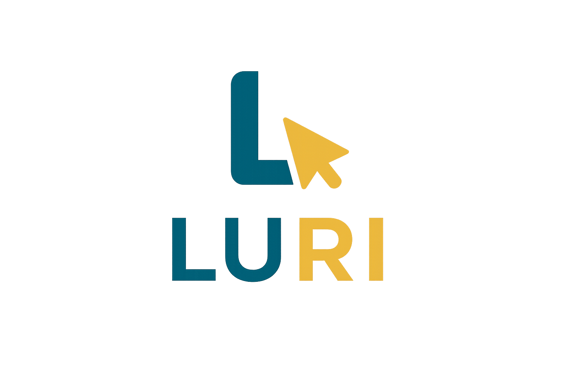

# AccesoUniversal — Proyecto Intermodular 2SMR

Proyecto web de accesibilidad digital desarrollado para el módulo de Aplicaciones Web.  
La web se adapta al usuario según su perfil de discapacidad, activando herramientas específicas para cada caso.

---

## Cómo abrir el proyecto

No hace falta ningún servidor ni instalación. Solo abre el archivo `index.html` con cualquier navegador moderno (Chrome recomendado para las funciones de voz).

```
index.html  →  página de inicio / login
app.html  →  página principal con todas las herramientas
```

---

## Estructura de archivos

```
pagina proyecto/
│
├── index.html          → Página de login (punto de entrada)
├── app.html            → Página principal de accesibilidad
├── README.md
│
├── css/
│   ├── app.css         → Estilos principales (layout, componentes)
│   ├── modos.css       → Modo oscuro, alto contraste y responsive
│   └── login.css       → Estilos de la página de login
│
├── js/
│   ├── datos.js        → Datos estáticos (atajos, comandos, mensajes)
│   └── app.js          → Toda la lógica JavaScript de la web
│
└── assets/
    └── images/
        ├── bienvenida.png  → Imagen decorativa del login
        ├── google.jpg      → Logo de Google (botón social)
        └── facebook.jpg    → Logo de Facebook (botón social)
```

---

## Página de login — `index.html`

Es la primera página que ve el usuario. Tiene un formulario de inicio de sesión y dos botones de acceso rápido con Google y Facebook.

### Estructura HTML

```html
<!-- Lado izquierdo: imagen decorativa -->
<div class="imagen">
    
</div>
```
El `div.imagen` ocupa la mitad izquierda de la pantalla con una foto de fondo. Al pasar el ratón por encima hace un zoom suave (definido en el CSS).

```html
<!-- Lado derecho: formulario -->
<div class="contenedor_login">
    <form action="/login" method="POST">
```
El formulario envía los datos al servidor con el método POST. El `action="/login"` indica la ruta del servidor a la que se enviarían los datos (en este proyecto es solo visual, no hay backend real).

```html
        <fieldset>
            <legend>Iniciar sesión</legend>
            <label for="email">Correo electrónico</label>
            <input type="email" id="email" name="email" placeholder="tu@correo.com" required>
            <label for="password">Contraseña</label>
            <input type="password" id="password" name="password" placeholder="••••••••" required>
            <a href="app.html" class="btn-entrar">Entrar</a>
        </fieldset>
```
El `fieldset` agrupa campos relacionados y el `legend` les da un título visible. El atributo `required` hace que el navegador pida rellenar el campo antes de enviar. El botón "Entrar" es en realidad un enlace `<a>` que lleva directamente a `app.html`.

```html
        <div class="separador"><hr><span>o</span><hr></div>
```
Separador visual entre los dos métodos de acceso. Dos líneas horizontales con la letra "o" en medio.

```html
        <fieldset>
            <legend>Nuevo usuario</legend>
            <div class="social-btns">
                <button type="button" class="btn-social">
                    
                    Acceder con Google
                </button>
                ...
            </div>
        </fieldset>
```
Botones sociales. Son de tipo `button` (no `submit`) porque en este proyecto no tienen funcionalidad real de autenticación.

---

## Página principal — `app.html`

Es la página más compleja del proyecto. Contiene la barra de navegación, la cabecera hero, las tarjetas de perfil y los cuatro paneles de herramientas.

### Parte invisible del HTML (antes del `<body>` visible)

```html
<svg style="display:none" aria-hidden="true" xmlns="http://www.w3.org/2000/svg">
    <symbol id="ico-logo" viewBox="0 0 32 32"> ... </symbol>
    <symbol id="ico-eye"  viewBox="0 0 24 24"> ... </symbol>
    ...
</svg>
```
Bloque SVG oculto que define los iconos una sola vez. Cada `<symbol>` tiene un `id`. Para usar el icono en cualquier parte de la página se escribe `<use href="#ico-ojo"/>` sin repetir el código SVG completo.

```html
<div id="aria-live" class="sr-only" aria-live="polite" aria-atomic="true"></div>
```
Región invisible para lectores de pantalla. Cuando JavaScript escribe texto aquí, el lector de pantalla lo lee en voz alta automáticamente. El atributo `aria-live="polite"` significa que espera a que el usuario termine de leer lo actual antes de anunciar.

```html
<a href="#main-content" class="skip-link">Saltar al contenido principal</a>
```
Enlace que solo aparece al pulsar `Tab` por primera vez. Permite a los usuarios de teclado saltarse la barra de navegación e ir directamente al contenido.

```html
<div id="toast" role="status" aria-live="polite"></div>
```
Notificación emergente pequeña en la esquina inferior derecha. JavaScript le añade texto y la clase `.show` para hacerla visible.

### Barra de navegación

```html
<nav class="navbar" aria-label="Barra de accesibilidad">
    <div class="nav-inner">
        <a href="index.html" class="nav-brand"> ... AccesoUniversal </a>
        <div class="nav-tools">
            <button id="theme-btn" onclick="cambiarModoOscuro()">Oscuro</button>
            <button onclick="cambiarTamanoLetra(2)">A+</button>
            <button onclick="cambiarTamanoLetra(-2)">A−</button>
            <button onclick="restablecerLetra()">A↺</button>
            <button id="btn-contraste" onclick="activarAltoContraste()">Contraste</button>
            <button id="voice-btn" onclick="iniciarVoz()">Voz</button>
            <button onclick="pararAudio()">Parar</button>
        </div>
    </div>
</nav>
```
La barra está fija arriba (`position:sticky`). Cada botón llama a una función de JavaScript al hacer clic. Los atributos `aria-label` describen el botón a los lectores de pantalla.

### Cabecera hero

```html
<header class="hero">
    <div class="hero-inner">
        <div class="hero-eyebrow">Accesibilidad Digital · WCAG 2.2</div>
        <h1 class="hero-title">La web para <em>todas</em> las personas</h1>
        <p class="hero-sub">Elige tu perfil...</p>
        <div class="hero-pills">
            <button class="hero-pill pill-v" onclick="seleccionarPerfil('visual')">Baja visión</button>
            <button class="hero-pill pill-a" onclick="seleccionarPerfil('auditiva')">Dif. auditiva</button>
            <button class="hero-pill pill-m" onclick="seleccionarPerfil('motora')">Movilidad reducida</button>
            <button class="hero-pill pill-c" onclick="seleccionarPerfil('cognitiva')">Cognitiva</button>
        </div>
    </div>
    <div class="hero-deco" aria-hidden="true">
        <div class="deco-ring deco-r1"></div>  <!-- anillo decorativo grande -->
        <div class="deco-ring deco-r2"></div>  <!-- anillo decorativo mediano -->
        <div class="deco-ring deco-r3"></div>  <!-- anillo decorativo pequeño -->
    </div>
</header>
```
Los botones `.hero-pill` son accesos rápidos a los perfiles. Al pulsarlos llaman a `seleccionarPerfil()` con el nombre del perfil. Los `deco-ring` son círculos decorativos de fondo, marcados con `aria-hidden="true"` para que los lectores de pantalla los ignoren.

### Tarjetas de perfil

```html
<section class="sec-profiles" aria-labelledby="titulo-perfil">
    <div class="profile-grid">
        <button class="pcard pcard-v" id="profile-visual"
                onclick="seleccionarPerfil('visual')" aria-pressed="false">
            <div class="pcard-top">
                <div class="pcard-icon"> [icono SVG] </div>
                <span class="pcard-tag">Visual</span>
            </div>
            <strong class="pcard-title">Baja visión</strong>
            <p class="pcard-desc">Lector de voz, alto contraste...</p>
            <span class="pcard-cta">Activar perfil →</span>
        </button>
        <!-- igual para auditiva, motora y cognitiva -->
    </div>
</section>
```
Cada tarjeta es un `<button>` (no un `<div>`) para que sea activable con teclado. El atributo `aria-pressed="false"` indica a los lectores de pantalla si está seleccionado. JavaScript lo cambia a `"true"` cuando se activa el perfil.

### Los cuatro paneles de herramientas

Cada panel está oculto por defecto (`hidden`). JavaScript muestra el correspondiente cuando el usuario elige un perfil.

#### Panel Visual (`id="panel-visual"`)
Herramientas para personas con baja visión:
- **Lector TTS**: `<textarea id="tts-input">` donde se pega el texto + `<input type="range" id="tts-speed">` para la velocidad
- **Ajustes de visión**: botones para contraste, modo oscuro y tamaño de letra
- **Lectores de pantalla**: información sobre compatibilidad con NVDA, JAWS, VoiceOver y TalkBack

#### Panel Auditivo (`id="panel-auditiva"`)
Herramientas para personas con dificultad auditiva:
- **Alertas visuales**: cuatro botones que generan notificaciones visuales (error, mensaje, éxito, aviso) sin depender del sonido

#### Panel Motor (`id="panel-motora"`)
Herramientas para personas con movilidad reducida:
- **Atajos de teclado**: lista generada automáticamente por JavaScript desde `SHORTCUTS` en `datos.js`
- **Control por voz**: botón para activar el micrófono y lista de comandos desde `COMMANDS`
- **Botones grandes**: cuatro acciones de gran tamaño (ir arriba, leer, ampliar, parar)

#### Panel Cognitivo (`id="panel-cognitiva"`)
Herramientas para dislexia y dificultades cognitivas:
- **Regla de lectura**: línea amarilla que sigue al ratón
- **Fuente para dislexia**: tipografía más legible + `<input type="range" id="spacing-range">` para el espaciado
- **Filtros de color**: seis botones con fondo de color para reducir fatiga visual

### Barra flotante inferior

```html
<nav class="floating-dock" aria-label="Accesos rápidos">
    <button onclick="leerPagina()">         Leer     Alt+1 </button>
    <button onclick="activarAltoContraste()"> Contraste Alt+3 </button>
    <button onclick="cambiarTamanoLetra(4)"> Ampliar  Alt+4 </button>
    <button onclick="activarLecturaFacil()"> Fácil    Alt+5 </button>
</nav>
```
Barra fija en la parte inferior de la pantalla con las cuatro acciones más usadas. Al pasar el ratón aparece un tooltip explicativo.

---

## CSS — `app.css`

Contiene los estilos principales del layout y los componentes.

### Variables de color por perfil

El diseño usa cuatro colores, uno por perfil:

| Perfil | Color principal | Clase |
|--------|----------------|-------|
| Visual | Violeta `#7c3aed` | `.tc-v`, `.icon-v`, `.tbtn-v` |
| Auditivo | Verde `#059669` | `.tc-a`, `.icon-a`, `.tbtn-a` |
| Motor | Azul `#0284c7` | `.tc-m`, `.icon-m`, `.tbtn-m` |
| Cognitivo | Naranja `#d97706` | `.tc-c`, `.icon-c`, `.tbtn-c` |

### Clases principales

| Clase | Para qué sirve |
|-------|---------------|
| `.navbar` | Barra de navegación fija arriba |
| `.hero` | Cabecera con gradiente azul/morado |
| `.profile-grid` | Cuadrícula de 4 tarjetas de perfil (auto-fit) |
| `.pcard` | Tarjeta de perfil individual |
| `.tools-grid` | Cuadrícula de herramientas dentro de cada panel |
| `.tool-card` | Tarjeta de herramienta individual |
| `.tc-header` | Cabecera de una tarjeta (icono + título) |
| `.tbtn` | Botón de acción principal (redondeado) |
| `.tgl-btn` | Botón de toggle (activar/desactivar) |
| `.floating-dock` | Barra flotante inferior |
| `.dock-btn` | Botón dentro de la barra flotante |
| `.va-notif` | Notificación visual con barra de progreso |
| `.shortcut-item` | Elemento de la lista de atajos de teclado |
| `.bigaction-btn` | Botón grande para movilidad reducida |
| `.color-swatch` | Botón de filtro de color |
| `.mb-4` | Utilidad: margen inferior de 16px |
| `.tgl-static` | Botón de toggle no interactivo (solo informativo) |
| `.hint-text` | Texto de ayuda en gris pequeño |

---

## CSS — `modos.css`

Contiene únicamente los estilos que cambian cuando se activan modos especiales.

### Modo oscuro (clase `body.dark-mode`)
Cuando JavaScript añade la clase `dark-mode` al `<body>`, todas las reglas de este bloque sobreescriben los colores claros por versiones oscuras:
- Fondo: `#0b0f1a` (azul noche muy oscuro)
- Texto: `#f1f5f9` (gris claro)
- Tarjetas y paneles: `#141c2e` (azul marino oscuro)

### Alto contraste (clase `body.high-contrast`)
Convierte toda la página a fondo negro con texto amarillo fluorescente. Usa `!important` para sobreescribir cualquier otro estilo. Los enlaces se ponen en cian para diferenciarlos.

### Modos de accesibilidad

| Clase en `<body>` | Efecto |
|-------------------|--------|
| `easy-read` | Fuente Arial, tamaño 1.15rem, líneas más separadas, máximo 65 caracteres por línea |
| `large-targets` | Todos los botones, enlaces e inputs tienen mínimo 56×56px |
| `dyslexia-font` | Fuente Arial, más espaciado entre letras y palabras, interlineado 2.2 |

### Responsive (pantallas menores de 640px)
Adapta el diseño para móvil: las píldoras del hero se apilan en columna, las cuadrículas pasan a una sola columna, y los botones de la barra flotante se hacen más pequeños.

---

## CSS — `login.css`

Estilos de la página de login. Diseño en dos columnas con flexbox:
- `.imagen`: columna izquierda, ocupa todo el alto disponible con `flex:1`
- `.contenedor_login`: columna derecha fija de 420px de ancho
- `fieldset`: sin borde, solo estructura visual
- `.btn-entrar`: botón negro con letras en mayúscula
- `.btn-social`: botón con logo y texto, borde fino

---

## JavaScript — `datos.js`

Archivo de solo datos. No tiene funciones. Define variables globales que usa `app.js`.

```javascript
var SHORTCUTS = [ ['Tab', 'Siguiente elemento'], ['Alt+D', 'Modo oscuro'], ... ]
```
Array de pares `[tecla, descripción]`. Se usa para generar la lista de atajos en el panel motor.

```javascript
var COMMANDS = [ ['oscuro', 'modo oscuro'], ['más grande', 'letra mayor'], ... ]
```
Array de pares `[palabra clave, descripción]`. Se usa para generar la lista de comandos de voz.

```javascript
var SPACING_LABELS = ['Normal', 'Amplio', 'Muy amplio', 'Máximo']
var SPACING_VALUES = [
    { letterSpacing:'', wordSpacing:'', lineHeight:'' },        // nivel 0: sin cambios
    { letterSpacing:'0.06em', wordSpacing:'0.15em', lineHeight:'2' },  // nivel 1
    ...
]
```
Etiquetas y valores CSS para el control deslizante de espaciado del perfil cognitivo.

```javascript
var PROFILE_MSGS = {
    visual:    'Perfil de discapacidad visual activado...',
    auditiva:  'Perfil de discapacidad auditiva activado...',
    ...
}
```
Mensajes que el lector de voz pronuncia al activar cada perfil.

```javascript
var DATOS_ALERTAS = {
    error:   { color:'#ef4444', titulo:'Error del sistema', desc:'...', icono:'✕' },
    mensaje: { color:'#3b82f6', titulo:'Mensaje nuevo',     desc:'...', icono:'✉' },
    exito:   { color:'#22c55e', titulo:'Acción completada', desc:'...', icono:'✓' },
    aviso:   { color:'#f59e0b', titulo:'Aviso importante',  desc:'...', icono:'⚠' }
}
```
Datos de las cuatro alertas visuales del perfil auditivo. Cada entrada tiene color, título, descripción e icono.

---

## JavaScript — `app.js`

Toda la lógica interactiva. Se carga después de `datos.js` para poder usar sus variables.

### Variables globales

```javascript
var sintesis = window.speechSynthesis;  // API de síntesis de voz del navegador
var timerToast;       // Temporizador para ocultar el toast automáticamente
var PANELES = ['visual','auditiva','motora','cognitiva'];  // IDs de los cuatro paneles
var perfilActual = null;  // Qué perfil está activo ahora mismo
var reglaEl = null;       // Referencia al elemento de la regla de lectura
var capaColor = null;     // Referencia al div del filtro de color
```

### Funciones de audio

**`leerTexto(texto)`**
Lee un texto en voz alta usando la API Web Speech. Cancela lo que estuviera sonando antes. También escribe el texto en `#aria-live` para que los lectores de pantalla externos lo detecten.

**`leerPagina()`**
Recorre todos los `h2`, `h3` y `p` del contenido principal y los concatena en un texto que luego pasa a `leerTexto()`.

**`leerTextoPersonalizado()`**
Lee el texto escrito en el `<textarea id="tts-input">` con la velocidad ajustada por el range `#tts-speed`. Si el textarea está vacío muestra un aviso.

**`pararAudio()`**
Cancela la síntesis de voz en curso con `sintesis.cancel()`.

### Funciones de interfaz

**`mostrarMensaje(msg)`**
Muestra el texto `msg` en el `<div id="toast">`. Lo hace visible añadiendo la clase `.show` y lo oculta automáticamente a los 3 segundos.

**`cambiarFuncion(clase, idBtn, msgOn, msgOff, clave)`**
Función genérica que activa o desactiva cualquier modo de accesibilidad. Alterna una clase CSS en el `<body>`, guarda el estado en `localStorage`, actualiza el atributo `aria-pressed` del botón y anuncia el cambio por audio. La usan `activarAltoContraste`, `activarLecturaFacil`, `activarBotonesGrandes` y `activarFuenteDislexia`.

**`cambiarModoOscuro()`**
Alterna la clase `dark-mode` en el `<body>`. Actualiza el texto del botón a "Modo claro" o "Modo oscuro" según corresponda. Guarda el estado en `localStorage` con la clave `darkMode`.

**`cambiarTamanoLetra(cantidad)`**
Lee el tamaño de fuente actual del `<body>` en píxeles, le suma `cantidad` (puede ser positivo o negativo) y aplica el nuevo valor. El resultado está limitado entre 12px y 64px.

**`restablecerLetra()`**
Vuelve el tamaño de fuente al valor original de 17px.

### Funciones de perfiles

**`seleccionarPerfil(tipo)`**
Es la función más importante. Hace lo siguiente en orden:
1. Si había otro perfil activo, limpia sus ajustes llamando a `limpiezaPerfil[perfilActual]()`
2. Oculta la sección de tarjetas (`.sec-profiles`)
3. Muestra solo el panel del perfil elegido (`panel-visual`, `panel-auditiva`, etc.)
4. Marca la tarjeta como seleccionada (`aria-pressed="true"`)
5. Activa los ajustes automáticos del perfil (`accionesPerfil[tipo]()`)
6. Lee en voz alta el mensaje de bienvenida del perfil
7. Hace scroll hasta el panel con animación suave

**`volverPerfiles()`**
Deshace todo lo que hizo `seleccionarPerfil`: limpia el perfil actual, oculta todos los paneles, muestra de nuevo la sección de tarjetas y hace scroll hasta el título.

**`accionesPerfil`** — objeto con las acciones automáticas al entrar en cada perfil:
- `visual`: activa alto contraste si no está ya activo
- `auditiva`: no hace nada automático
- `motora`: activa botones grandes si no están ya activos
- `cognitiva`: activa lectura fácil y regla de lectura

**`limpiezaPerfil`** — objeto con las acciones de limpieza al salir de cada perfil:
- `visual`: desactiva el alto contraste y cancela el audio
- `motora`: desactiva los botones grandes
- `cognitiva`: desactiva lectura fácil, regla de lectura, y resetea el espaciado a 0

### Funciones cognitivas

**`aplicarEspaciado(nivel)`**
Toma el nivel (0-3) del range `#spacing-range` y aplica los valores de `SPACING_VALUES[nivel]` al `<body>`: `letter-spacing`, `word-spacing` y `line-height`. Actualiza la etiqueta y el texto de vista previa.

**`activarReglaLectura()`**
Alterna la visibilidad del `<div id="reading-ruler">`. Cuando se activa, añade un listener `mousemove` al documento que llama a `moverRegla()`. Al desactivar, elimina ese listener para no consumir recursos.

**`moverRegla(e)`**
Mueve el div de la regla verticalmente para que siga la posición del ratón. Calcula `e.clientY - 18` para que la línea quede centrada en el cursor.

**`aplicarFiltroColor(color)`**
Crea un `<div>` con `position:fixed` que cubre toda la pantalla con un color semitransparente (`mix-blend-mode:multiply`). Si se llama con el mismo color que ya está activo, o con `'none'`, lo elimina.

### Alertas visuales

**`mostrarAlertaVisual(tipo)`**
Crea dinámicamente un elemento `.va-notif` con icono, título, descripción, botón de cierre y barra de progreso. Lo inserta en `#va-notif-area`. Si ya hay 3 notificaciones, elimina la más antigua. La notificación desaparece sola a los 4.2 segundos con una animación de salida.

### Control por voz

**`iniciarVoz()`**
Activa el micrófono usando la API `SpeechRecognition` del navegador (solo Chrome y Edge). Muestra el botón parpadeando mientras escucha. Cuando detecta voz, pasa el texto a `procesarComando()`.

**`procesarComando(cmd)`**
Analiza el texto reconocido buscando palabras clave con `includes()`:

| Palabra clave | Acción |
|---------------|--------|
| `oscuro` / `claro` | Alterna modo oscuro |
| `grande` / `aumenta` | Aumenta el texto 4px |
| `pequeño` / `reduce` | Reduce el texto 4px |
| `detener` / `para` | Para el audio |
| `inicio` | Sube al principio de la página |
| `ayuda` | Lee las instrucciones de uso |

### Inicialización (DOMContentLoaded)

Al cargar la página, JavaScript:
1. Comprueba `localStorage` y restaura las preferencias guardadas (modo oscuro, contraste, lectura fácil)
2. Añade un listener al range de velocidad para actualizar la etiqueta en tiempo real
3. Genera el HTML de la lista de atajos de teclado usando `SHORTCUTS` de `datos.js`
4. Genera el HTML de la lista de comandos de voz usando `COMMANDS` de `datos.js`

### Atajos de teclado globales

Listener permanente sobre `document` que detecta combinaciones con `Alt`:

| Atajo | Función |
|-------|---------|
| `Alt + D` | Modo oscuro |
| `Alt + V` | Activar reconocimiento de voz |
| `Alt + 1` | Leer página completa |
| `Alt + 3` | Alto contraste |
| `Alt + 4` | Ampliar texto |
| `Alt + 5` | Lectura fácil |
| `Escape` | Parar audio |

---

## Cómo usar la web (guía de usuario)

### Paso 1 — Abrir el proyecto
Abre `index.html` en Chrome. Escribe cualquier correo y contraseña (el formulario no valida contra ningún servidor) y pulsa "Entrar".

### Paso 2 — Elegir un perfil
En la página principal verás cuatro tarjetas. Haz clic en la que corresponda a tus necesidades o pulsa los botones de la cabecera.

### Paso 3 — Usar las herramientas
Cada perfil muestra sus herramientas. Puedes:
- Usar los botones de la barra superior en cualquier momento (modo oscuro, tamaño de letra, contraste, voz)
- Usar los atajos de teclado listados en la tabla anterior
- Volver a cambiar de perfil con el botón "Cambiar perfil" del banner

### Paso 4 — Las preferencias se guardan
El modo oscuro, el alto contraste y la lectura fácil se guardan en el navegador (`localStorage`). La próxima vez que abras la web, los ajustes se recuperan automáticamente.

---

## Tecnologías usadas

| Tecnología | Uso |
|------------|-----|
| HTML5 semántico | Estructura de la web |
| CSS3 (Grid, Flexbox, Custom Properties) | Diseño y layout |
| JavaScript vanilla (sin librerías) | Toda la lógica |
| Web Speech API | Síntesis de voz y reconocimiento |
| localStorage | Guardar preferencias del usuario |
| SVG inline | Iconos vectoriales sin imágenes externas |
| WCAG 2.2 AA | Estándar de accesibilidad web |
| ARIA 1.2 | Atributos de accesibilidad para lectores de pantalla |

---

## Compatibilidad con lectores de pantalla

La web es compatible con:
- **NVDA** (Windows) — gratuito
- **JAWS** (Windows) — de pago
- **VoiceOver** (Mac / iOS) — integrado en el sistema
- **TalkBack** (Android) — integrado en el sistema

Toda la navegación es posible solo con el teclado: `Tab` para moverse, `Enter` o `Espacio` para activar, `Escape` para cancelar.

---